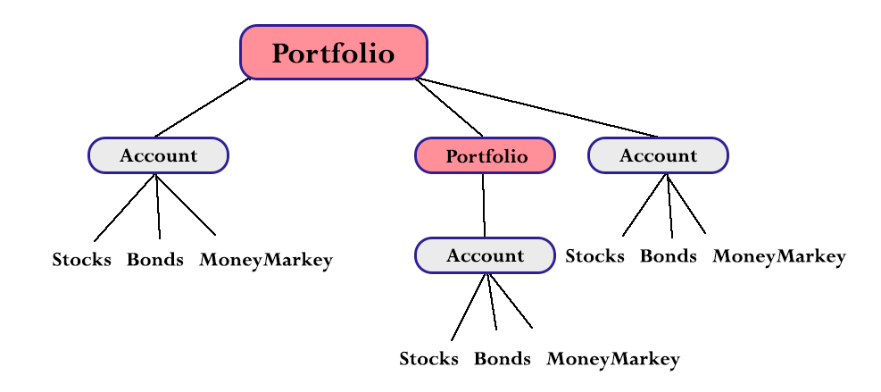

Portfolio
=========

Java Composite Design Pattern Demo

Class Definitions
-------------------

PortfolioComponent.java - The componet abstract class. A Portfolio can have both Portfolios and Accounts.

Portfolio - Composite class.

Account.java - Abstract Account class (Leaf). Base class for Stocks, Bonds, and MoneyMarket.

Stocks, Bonds, MoneyMarket.java - A portfolios securities. Child of Accounts class (Leafs).

PortfolioIterator.java - Iterator class. This iterator escorts the visitor and evaluates the portfolio. For brevity, evaluating a portfolio is summing up all the securities on all the accounts (an arbitrary number).

PortfolioManager.java - Singleton class, builds the portfolio with hardcoded values.

CreatePortfolio.java - Main class. Calls Portfoliomanager. 

SCREENSHOTS:
____________

